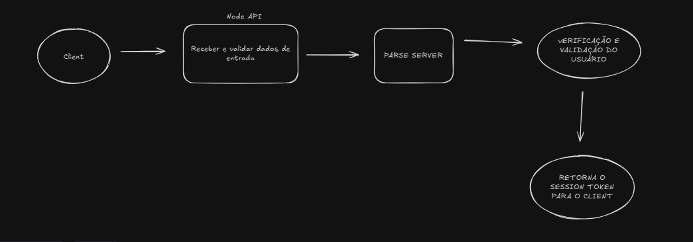

<h3 align="center">
  Desafio Node.Js/Parse Server - MobApps
</h3>

## :rocket: Sobre o desafio

Nesse desafio, você deve criar uma aplicação utilizando o Parse Server + Node.js que irá possibilitar o cadastramento de filmes, listagem dos filmes, atualização dos filmes e busca.

A Aplicação não precisa conter interface visual. O que importa é seu style code, patterns usados e boas práticas usando JS.
### Requisitos

-**Autenticação** Criar um endpoint para autenticação passando um email e uma senha e retornando um token que deverá ser usado para acessar todas outras requisições. Recomendamos usar o JWT.

**Cadastrar Filmes** Sua aplicação deverá conter um endpoint para possibilitar a inserção de novos filmes(um ou mais) com os seguintes campos (Título, descrição, poster(imagem), data de lançamento. 
*Todos os dados devem ser persistidos no banco de dados do ParseServer

**Listar Filmes** Sua aplicação deverá conter um endpoint para possibilitar a listagem dos filmes, retornando uma lista em JSON.

**Atualizar Filme** Sua aplicação deverá conter um endpoint para possibilitar a atualização de um filme pelo ObjectId dele no parse.

**Buscar filmes** Sua aplicação deverá conter um endpoint que permita a busca de filmes através dos seguintes parâmetros (Título, data de lançamento)

**Live Query** 
### Diferenciais
 - Os testes não são obrigatórios mas iremos adorar caso você implemente. Aqui na Mob, usamos a lib Mocha.
 - Arquitetura do projeto. Mais importante que a aplicação funcionar é seu style code e como você arquiteturou a solução.

## Links úteis

- <a href="https://github.com/parse-community/parse-server" target="_blank" align="center">Parse Server</a>
- <a href="https://docs.parseplatform.org/js/guide/" target="_blank" align="center">Parse JS SDK</a>
- <a href="https://docs.parseplatform.org/" target="_blank" align="center">Parse Platform</a>


## Após os testes queremos seu feedback
Após encaminhar seu teste você será convidado para um novo bate papo e queremos o seu feedback sobre o que achou desse teste.

## O que foi desenvolvido

### Estrutura do projeto

```
/src
  ├── /auth          # Lógica de autenticação do usuário
  ├── /common        # Métodos e funções compartilhadas entre módulos
  ├── /config        # Arquivos de configuração
  ├── /movies        # CRUD de filmes
  └── /user          # Lógica de tratamento de dados do usuário
```

### Módulos implementados

#### 🔐 Auth


- **Autenticação JWT**: Sistema completo de login/registro
- **Middleware de autenticação**: Proteção de rotas privadas
- **Integração com Parse Server**: Gerenciamento de sessões

#### 🎬 Movies
- **CRUD completo**: Criar, listar, buscar, atualizar e deletar filmes
- **Upload de imagens**: Endpoint para adicionar poster aos filmes
- **Filtros de busca**: Por título, ano e gênero
- **Paginação**: Listagem com controle de limite e página

#### 👤 User
- **Gerenciamento de usuários**: Criação e manipulação de dados
- **Integração com autenticação**: Vinculação com sistema de auth

#### 🛠️ Common
- **Tratamento de erros**: Sistema centralizado de exceções
- **Middlewares**: Funcionalidades compartilhadas
- **Types**: Definições de tipos TypeScript

#### ⚙️ Config
- **Variáveis de ambiente**: Configuração centralizada
- **Parse Server**: Inicialização e configuração
- **Validação**: Schemas com Zod

### Fluxo de Autenticação



### Tecnologias utilizadas


### Funcionalidades implementadas

✅ **Autenticação JWT**  
✅ **Cadastrar filmes** (um ou múltiplos)  
✅ **Listar filmes** com paginação  
✅ **Atualizar filme** por ID  
✅ **Buscar filmes** por título, ano e gênero  
✅ **Upload de poster** para filmes  
✅ **Documentação Swagger**  
✅ **Tratamento de erros**  
✅ **Arquitetura limpa** com separação de responsabilidades  

### Como executar

1. **Clone o repositório**
```bash
git clone <repo-url>
cd desafio-nodejs-parse
```

2. **Configure as variáveis de ambiente**
```bash
cp .env.example .env
# Edite o arquivo .env com suas configurações
```

3. **Inicie os serviços com Docker**
```bash
docker-compose up -d
```

4. **Instale as dependências**
```bash
pnpm install
```

5. **Execute a aplicação**
```bash
pnpm run start:dev
```

### Endpoints disponíveis

A documentação completa está disponível em: `http://localhost:3001/docs`

#### Autenticação
- `POST /auth/sign-up` - Criar conta
- `POST /auth/sign-in` - Login
- `POST /auth/logout`  - Excluir sessão

#### Filmes
- `POST /movies` - Criar filme(s)
- `GET /movies` - Listar filmes
- `GET /movies/:id` - Buscar filme por ID
- `PUT /movies/:id` - Atualizar filme
- `DELETE /movies/:id` - Deletar filme
- `POST /movies/:id/add-image` - Upload de poster

### Arquitetura

O projeto segue os princípios de **Clean Architecture** com separação clara de responsabilidades:

- **Handlers** (Infra): Controladores HTTP
- **Services** (App): Regras de negócio
- **Entities** (App): Modelos de domínio
- **Repositories** (Infra): Acesso a dados
- **DTOs** (App): Objetos de transferência de dados

